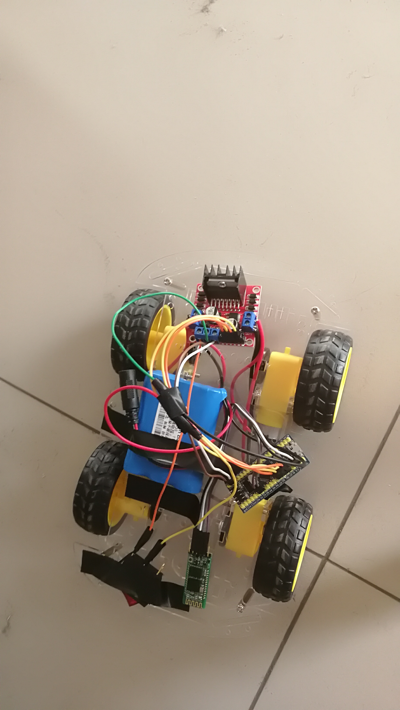
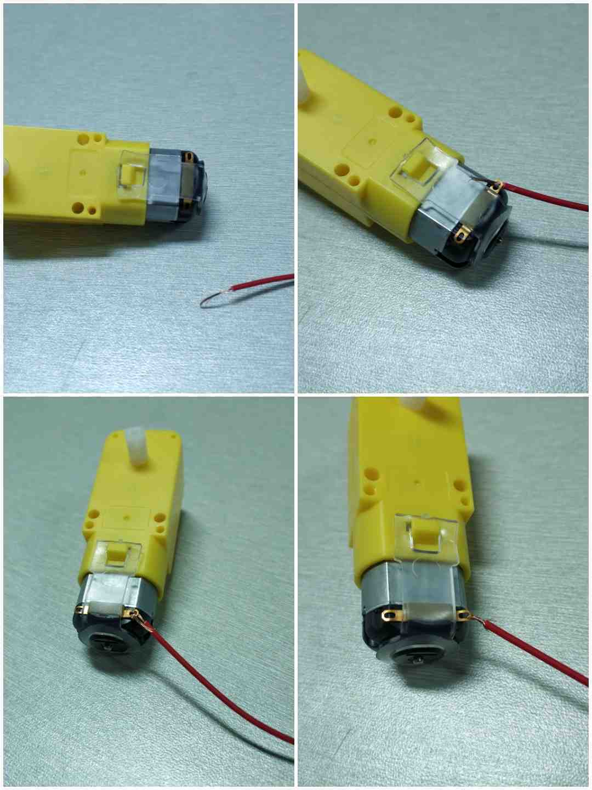
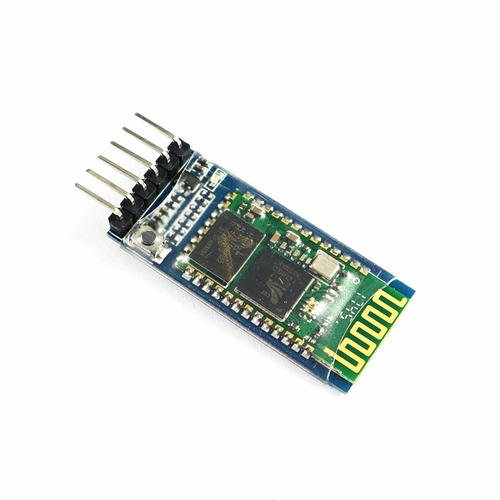
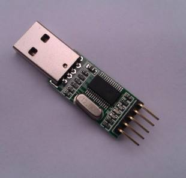
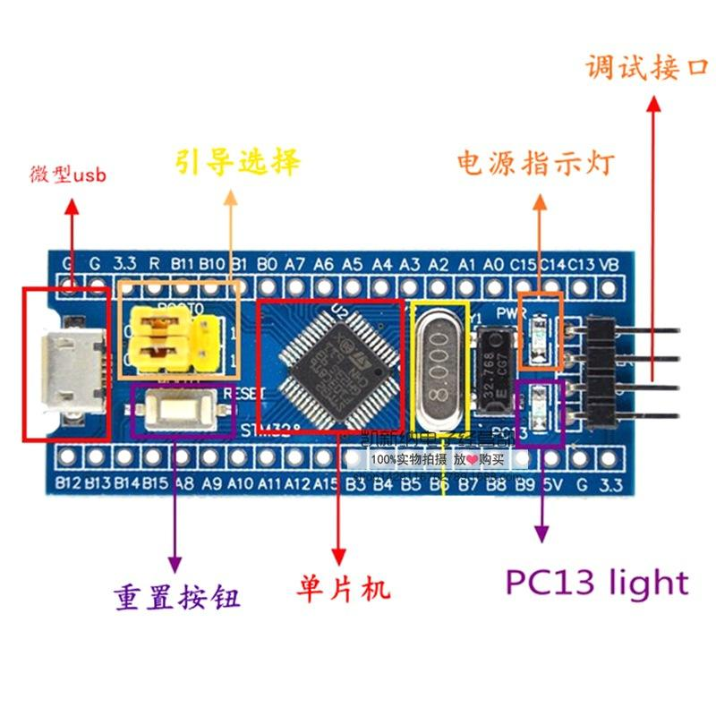
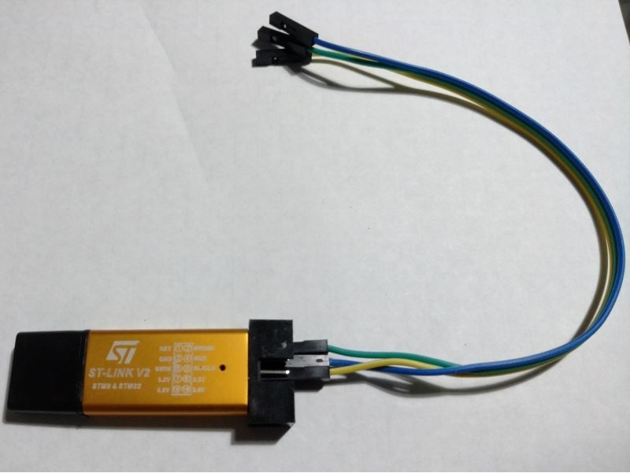
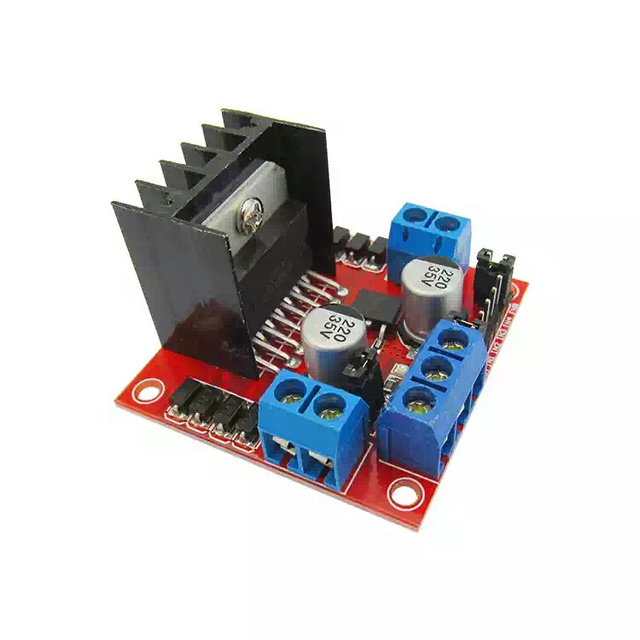
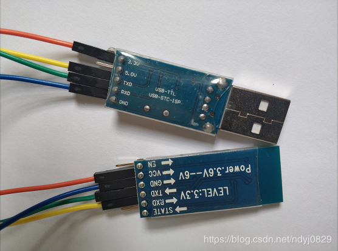
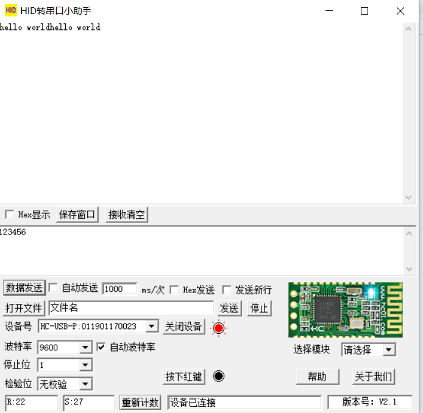
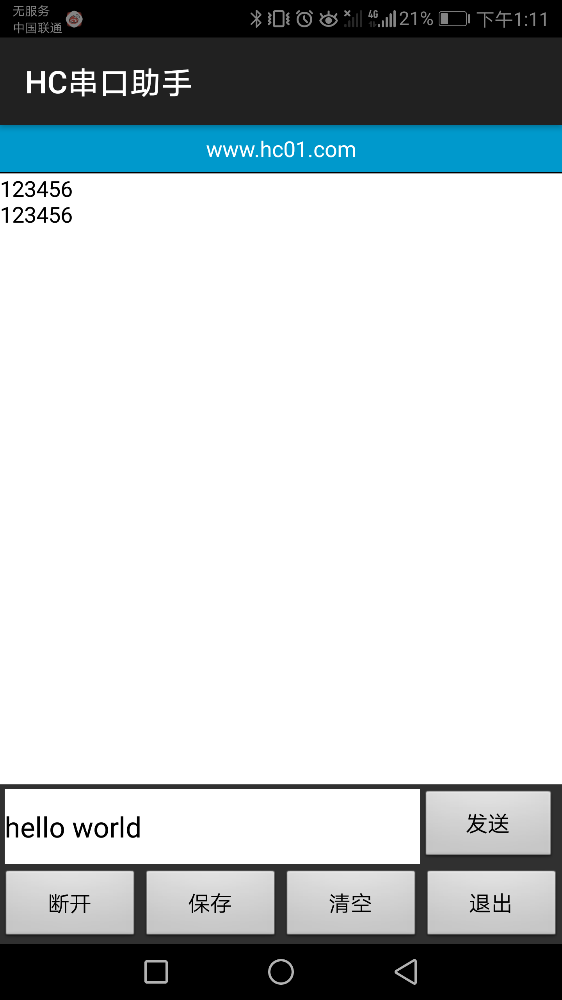

# Bluetooth_Remote_Controller_For_Car
This repository is Bluetooth_Remote_Controller_For_Car。 It uses Bluetooth to communicate with your phone     
                          
 这是小车的控制APP,欢迎下载  
                        

</img>

   
<a href = "https://github.com/DreamMemory001/Bluetooth_Remote_Controller_For_Car/tree/master/apk">点击下载</a> 

   
  
单片机的程序使用KEIL5写的，所以拿KIEL5直接打开就能进行烧录了 
      

> 做这个小车一定要有耐心，耐得下性子，不能急躁，应一一谨慎的进行排查错误，这样才能拼装并且调试完成这个小车。

> 先贴一个做成的成品图

## 小车实现的功能 
 - [x] 操控杆模式
 - [x] 重力感应模式
 - [ ] 红外感应模式
 - [ ] 循迹模式
 - [ ] 光感应模式
 
## 准备工作
### 一.需要的元器件及工具等
* 1.车身方面：四个步进电机， 四个轮子，俩块底板（这里是四驱，如果想做俩驱的可以相应的少一些模块）

* 2.通信方面：HC-05 蓝牙模块（也可以用HC-06），USB转TTL模块（购买蓝牙时就有配套，可以根据自己的实际情况进行选择）

 

* 3.控制单片机方面： STM32C8T6（51完全可以，但是一定要牢记，一定要使用晶振为11.0592的单片机，不然在传输过程中会有乱码的出现，这个是因为晶振即使为12，但是他的波特率误差也会在30%左右），ST-Link V6 烧录器
    
* 4.驱动方面： L298N电机驱动模块

* 5.电源方面：12V的锂电池或者航模电池（因为我这里是直接对L298N进行供电，然后利用L298N的5V供电接口再给单片机供电，也可以单独给单片机供电的）

* 6.其他：螺丝刀，电烙铁， 母对母导线若干。

## 动手操作
### 测试方面

电机测试：在电机俩端接一节干电池，测试电机是否能够正常运转。

蓝牙测试：先使用USB转TTL模块和蓝牙进行接线（接线图如下）， PC端使用HID转串口小助手，手机端使用HC串口助手进行调试。波特率一般使用9600，
手机端如果可以连上蓝牙之后正常发送数据，这说明蓝牙模块是OK的。（HID转串口小助手，HC串口助手和其他所要用到的工具都可以都在material包里边找到）

</img>

这是测试蓝牙成功的图片

   

  
  </img>
  </img>

## 未完待续 ！

